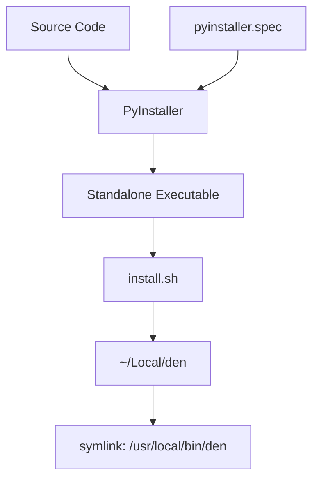

# Design Document: Executable Packaging

## Overview

This design describes how to package the den CLI application as a standalone executable binary and provide an installation script for deploying it to `/usr/local/bin/den` on macOS. The solution uses PyInstaller to bundle the Python application with all dependencies into a single executable file.

## Architecture

The packaging system consists of two main components:

1. **PyInstaller Configuration** - A `.spec` file that defines how to bundle the application
2. **Installation Script** - A shell script (`install.sh`) that orchestrates the build and installation process



## Components and Interfaces

### 1. PyInstaller Spec File (`den.spec`)

The spec file configures PyInstaller to:
- Use `src/den/main.py` as the entry point
- Bundle all dependencies (typer, anthropic, httpx)
- Create a single-file executable (`--onefile` mode)
- Name the output executable "den"

```python
# den.spec structure
a = Analysis(
    ['src/den/main.py'],
    pathex=[],
    binaries=[],
    datas=[],
    hiddenimports=['typer', 'anthropic', 'httpx'],
    ...
)
pyz = PYZ(a.pure)
exe = EXE(pyz, a.scripts, a.binaries, a.datas, name='den', ...)
```

### 2. Installation Script (`install.sh`)

A bash script that:
1. Checks for required tools (Python, pip, PyInstaller)
2. Installs PyInstaller if not present
3. Runs PyInstaller with the spec file
4. Creates `~/Local` directory if it doesn't exist
5. Copies the executable to `~/Local/den`
6. Creates a symbolic link from `/usr/local/bin/den` to `~/Local/den` using sudo
7. Verifies the installation

```bash
#!/bin/bash
# install.sh interface
# Usage: ./install.sh
# Exit codes:
#   0 - Success
#   1 - Missing dependencies
#   2 - Build failed
#   3 - Installation failed
```

### 3. Entry Point Wrapper

PyInstaller requires a script entry point. We'll create a minimal wrapper that invokes the Typer app:

```python
# Entry point for PyInstaller
from den.main import app
if __name__ == "__main__":
    app()
```

## Data Models

No persistent data models are required for this feature. The packaging process operates on:

- **Input**: Python source files, dependencies from `pyproject.toml`
- **Output**: Single executable binary file

## Correctness Properties

*A property is a characteristic or behavior that should hold true across all valid executions of a system-essentially, a formal statement about what the system should do. Properties serve as the bridge between human-readable specifications and machine-verifiable correctness guarantees.*

Based on the prework analysis, most acceptance criteria for this feature relate to build/installation processes and file system operations that are not amenable to property-based testing. The testable criteria are specific examples rather than universal properties.

**No property-based tests are applicable for this feature.**

The acceptance criteria are primarily:
- Build process verification (integration tests)
- File existence checks (example tests)
- Script behavior validation (manual/integration tests)

These are best validated through:
1. Manual testing of the installation script
2. Integration tests that run the built executable
3. CI/CD pipeline validation

## Error Handling

### Installation Script Errors

| Error Condition | Handling | Exit Code |
|----------------|----------|-----------|
| Python not installed | Display error message with installation instructions | 1 |
| PyInstaller not available | Attempt to install via pip, fail if unsuccessful | 1 |
| Build fails | Display PyInstaller error output | 2 |
| Cannot create ~/Local directory | Display error message | 3 |
| Cannot create symlink in `/usr/local/bin` | Prompt for sudo, fail if denied | 3 |
| Verification fails | Display diagnostic information | 3 |

### Script Error Messages

```bash
# Example error handling
if ! command -v python3 &> /dev/null; then
    echo "Error: Python 3 is required but not installed."
    exit 1
fi
```

## Testing Strategy

### Manual Testing

Since this feature involves system-level operations (file installation, executable creation), testing is primarily manual:

1. **Build Verification**
   - Run `./install.sh` and verify it completes without errors
   - Check that `dist/den` executable exists after build

2. **Installation Verification**
   - Verify `/usr/local/bin/den` exists after installation
   - Run `den --version` and verify correct output
   - Run `den hello` and verify functionality

3. **Error Handling Verification**
   - Test with missing Python (if possible)
   - Test without sudo access
   - Test with corrupted source files

### Integration Testing

A simple integration test can verify the executable works:

```bash
# After installation
den --version  # Should output version
den hello      # Should work correctly
```

### No Property-Based Testing

This feature does not have correctness properties suitable for property-based testing because:
- The acceptance criteria involve build processes and file system operations
- The outputs are binary files, not data transformations
- Verification is binary (works/doesn't work) rather than property-based
