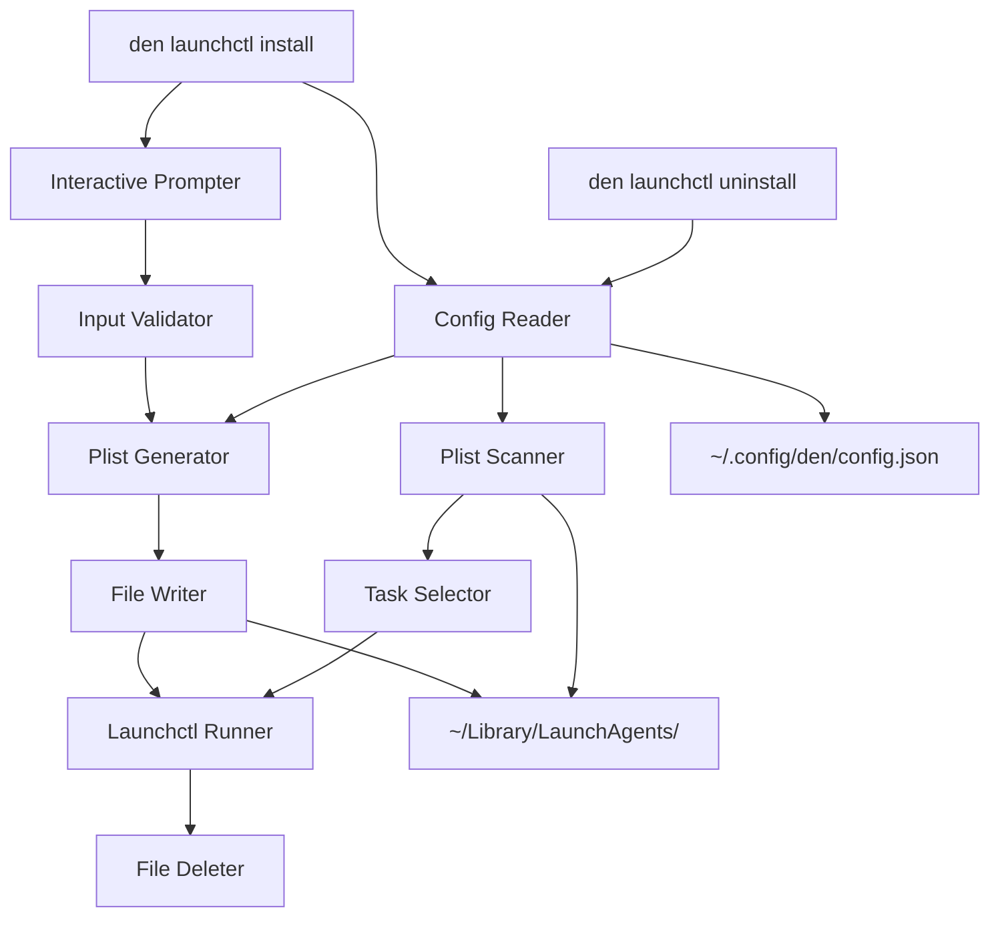

# Design Document: LaunchCtl Helper Command

## Overview

The LaunchCtl helper command extends the `den` CLI with capabilities to create and manage macOS LaunchAgent plist files through an interactive experience. The feature provides two subcommands (`install` and `uninstall`) that abstract away the complexity of XML plist file creation and `launchctl` system commands.

The implementation follows the existing `den` CLI patterns using Typer for command-line interface construction, with dedicated modules for configuration management, plist generation, and launchctl operations.

## Architecture



Both `install` and `uninstall` commands read the domain from the config file:
- **install**: Uses the domain to construct the plist label and filename (`[domain].[task].plist`)
- **uninstall**: Uses the domain to filter which plist files to display for selection

## Components and Interfaces

### 1. Config Reader (`launchctl_config.py`)

Responsible for reading the domain configuration from the user's config file.

```python
def get_domain() -> str:
    """Read domain from ~/.config/den/config.json or return default.
    
    Returns:
        The configured domain string, or 'com.example' if not configured.
    """
```

### 2. Input Validator (`launchctl_validator.py`)

Validates user input for task names, commands, and schedule values.

```python
def validate_task_name(name: str) -> tuple[bool, str]:
    """Validate task name contains only allowed characters.
    
    Args:
        name: The task name to validate.
        
    Returns:
        Tuple of (is_valid, error_message). error_message is empty if valid.
    """

def validate_command(command: str) -> tuple[bool, str]:
    """Validate command is non-empty.
    
    Args:
        command: The command string to validate.
        
    Returns:
        Tuple of (is_valid, error_message).
    """

def validate_interval(seconds: int) -> tuple[bool, str]:
    """Validate interval is positive.
    
    Args:
        seconds: The interval in seconds.
        
    Returns:
        Tuple of (is_valid, error_message).
    """

def validate_hour(hour: int) -> tuple[bool, str]:
    """Validate hour is in range 0-23.
    
    Args:
        hour: The hour value.
        
    Returns:
        Tuple of (is_valid, error_message).
    """

def validate_minute(minute: int) -> tuple[bool, str]:
    """Validate minute is in range 0-59.
    
    Args:
        minute: The minute value.
        
    Returns:
        Tuple of (is_valid, error_message).
    """
```

### 3. Plist Generator (`plist_generator.py`)

Generates valid XML plist content from task configuration.

```python
@dataclass
class TaskConfig:
    """Configuration for a LaunchAgent task."""
    label: str
    program_arguments: list[str]
    start_interval: int | None = None
    start_calendar_hour: int | None = None
    start_calendar_minute: int | None = None
    run_at_load: bool = True

def generate_plist(config: TaskConfig) -> str:
    """Generate plist XML content from task configuration.
    
    Args:
        config: The task configuration.
        
    Returns:
        Valid plist XML string.
    """

def parse_plist(content: str) -> TaskConfig:
    """Parse plist XML content into task configuration.
    
    Args:
        content: The plist XML string.
        
    Returns:
        TaskConfig parsed from the plist.
        
    Raises:
        PlistParseError: If the content is not valid plist XML.
    """
```

### 4. Launchctl Runner (`launchctl_runner.py`)

Executes launchctl system commands for loading and unloading agents.

```python
class LaunchctlError(Exception):
    """Raised when a launchctl command fails."""
    pass

def load_agent(plist_path: Path) -> None:
    """Load a LaunchAgent using launchctl.
    
    Args:
        plist_path: Path to the plist file.
        
    Raises:
        LaunchctlError: If the load command fails.
    """

def unload_agent(plist_path: Path) -> None:
    """Unload a LaunchAgent using launchctl.
    
    Args:
        plist_path: Path to the plist file.
        
    Raises:
        LaunchctlError: If the unload command fails.
    """
```

### 5. Plist Scanner (`plist_scanner.py`)

Scans the LaunchAgents directory for existing tasks.

```python
def scan_domain_agents(domain: str) -> list[Path]:
    """Find all plist files matching the given domain prefix.
    
    Args:
        domain: The domain prefix to match.
        
    Returns:
        List of paths to matching plist files.
    """

def extract_task_name(plist_path: Path, domain: str) -> str:
    """Extract the task name from a plist filename.
    
    Args:
        plist_path: Path to the plist file.
        domain: The domain prefix.
        
    Returns:
        The task name portion of the filename.
    """
```

### 6. Launchctl Command (`commands/launchctl.py`)

The Typer command group that orchestrates the interactive flow.

```python
launchctl_app = typer.Typer(help="LaunchAgent management commands.")

@launchctl_app.command()
def install() -> None:
    """Create and load a new LaunchAgent through interactive prompts."""

@launchctl_app.command()
def uninstall() -> None:
    """Unload and remove an existing LaunchAgent."""
```

## Data Models

### TaskConfig

```python
@dataclass
class TaskConfig:
    """Configuration for a LaunchAgent task.
    
    Attributes:
        label: The unique identifier for the LaunchAgent (domain.task format).
        program_arguments: List of command and arguments to execute.
        start_interval: Interval in seconds between runs (mutually exclusive with calendar).
        start_calendar_hour: Hour (0-23) for calendar-based scheduling.
        start_calendar_minute: Minute (0-59) for calendar-based scheduling.
        run_at_load: Whether to run immediately when loaded.
    """
    label: str
    program_arguments: list[str]
    start_interval: int | None = None
    start_calendar_hour: int | None = None
    start_calendar_minute: int | None = None
    run_at_load: bool = True
```

### Plist XML Structure

```xml
<?xml version="1.0" encoding="UTF-8"?>
<!DOCTYPE plist PUBLIC "-//Apple//DTD PLIST 1.0//EN" "http://www.apple.com/DTDs/PropertyList-1.0.dtd">
<plist version="1.0">
<dict>
    <key>Label</key>
    <string>{domain}.{task}</string>
    <key>ProgramArguments</key>
    <array>
        <string>{command}</string>
        <string>{arg1}</string>
        ...
    </array>
    <key>StartInterval</key>
    <integer>{seconds}</integer>
    <!-- OR -->
    <key>StartCalendarInterval</key>
    <dict>
        <key>Hour</key>
        <integer>{hour}</integer>
        <key>Minute</key>
        <integer>{minute}</integer>
    </dict>
    <key>RunAtLoad</key>
    <true/>
</dict>
</plist>
```


## Correctness Properties

*A property is a characteristic or behavior that should hold true across all valid executions of a system-essentially, a formal statement about what the system should do. Properties serve as the bridge between human-readable specifications and machine-verifiable correctness guarantees.*

### Property 1: Plist Round-Trip Consistency

*For any* valid `TaskConfig`, generating a plist XML string and then parsing it back should produce an equivalent `TaskConfig` object.

**Validates: Requirements 5.7**

### Property 2: Label Matches Configuration

*For any* valid domain string and task name, the generated plist's Label value should equal `{domain}.{task}`.

**Validates: Requirements 5.2**

### Property 3: Command Arguments Preserved

*For any* valid `TaskConfig` with a non-empty `program_arguments` list, the generated plist should contain all command arguments in the same order.

**Validates: Requirements 5.3**

### Property 4: Schedule Configuration Preserved

*For any* valid `TaskConfig` with either `start_interval` set or `start_calendar_hour`/`start_calendar_minute` set, the generated plist should contain the corresponding scheduling keys with the exact values specified.

**Validates: Requirements 5.4, 5.5**

### Property 5: Filename Format Correctness

*For any* valid domain string and task name, the constructed plist filename should match the pattern `{domain}.{task}.plist`.

**Validates: Requirements 2.4**

### Property 6: Domain Prefix Scanning Correctness

*For any* set of plist filenames and a domain prefix, the scanner should return exactly those files whose names start with `{domain}.` and end with `.plist`.

**Validates: Requirements 4.1**

### Property 7: Task Name Character Validation

*For any* string containing spaces, slashes, or special characters (other than hyphens and underscores), the task name validator should reject it. *For any* string containing only alphanumeric characters, hyphens, and underscores, the validator should accept it.

**Validates: Requirements 6.2**

### Property 8: Interval Validation

*For any* integer less than or equal to zero, the interval validator should reject it. *For any* positive integer, the validator should accept it.

**Validates: Requirements 6.4**

### Property 9: Hour Validation

*For any* integer outside the range 0-23, the hour validator should reject it. *For any* integer in the range 0-23, the validator should accept it.

**Validates: Requirements 6.5**

### Property 10: Minute Validation

*For any* integer outside the range 0-59, the minute validator should reject it. *For any* integer in the range 0-59, the validator should accept it.

**Validates: Requirements 6.6**

## Error Handling

### Configuration Errors

- **Missing config file**: Return default domain `com.example` without error
- **Invalid JSON in config file**: Log warning and return default domain
- **Missing domain key**: Return default domain without error

### Plist Generation Errors

- **Invalid TaskConfig**: Raise `PlistGenerationError` with descriptive message
- **File write failure**: Raise `OSError` with path information

### Launchctl Errors

- **Load failure**: Raise `LaunchctlError` with stderr output from launchctl
- **Unload failure**: Raise `LaunchctlError` with stderr output from launchctl
- **Permission denied**: Raise `LaunchctlError` indicating permission issue

### Scanner Errors

- **LaunchAgents directory missing**: Return empty list (directory may not exist yet)
- **Permission denied reading directory**: Raise `OSError` with descriptive message

## Testing Strategy

### Property-Based Testing

The implementation will use **Hypothesis** (already a dev dependency) for property-based testing. Each correctness property will be implemented as a separate property-based test with a minimum of 100 iterations.

Property tests will be tagged with comments in the format:
`**Feature: launchctl-helper, Property {number}: {property_text}**`

Key generators needed:
- `valid_task_names()`: Generates strings with only alphanumeric, hyphen, underscore characters
- `valid_domains()`: Generates reverse-DNS style domain strings
- `valid_task_configs()`: Generates complete TaskConfig objects with valid values
- `invalid_task_names()`: Generates strings with forbidden characters
- `out_of_range_hours()`: Generates integers outside 0-23
- `out_of_range_minutes()`: Generates integers outside 0-59

### Unit Testing

Unit tests will cover:
- Config reader with various file states (missing, empty, valid, invalid JSON)
- Individual validator functions with specific edge cases
- Launchctl runner with mocked subprocess calls
- Command integration with mocked dependencies

### Test File Organization

```
tests/
├── test_launchctl_config.py      # Config reader unit tests
├── test_launchctl_validator.py   # Validator unit tests  
├── test_plist_generator.py       # Plist generation unit tests
├── test_plist_scanner.py         # Scanner unit tests
├── test_launchctl_runner.py      # Runner unit tests (mocked)
├── test_launchctl_command.py     # Command integration tests
└── test_launchctl_properties.py  # Property-based tests
```
