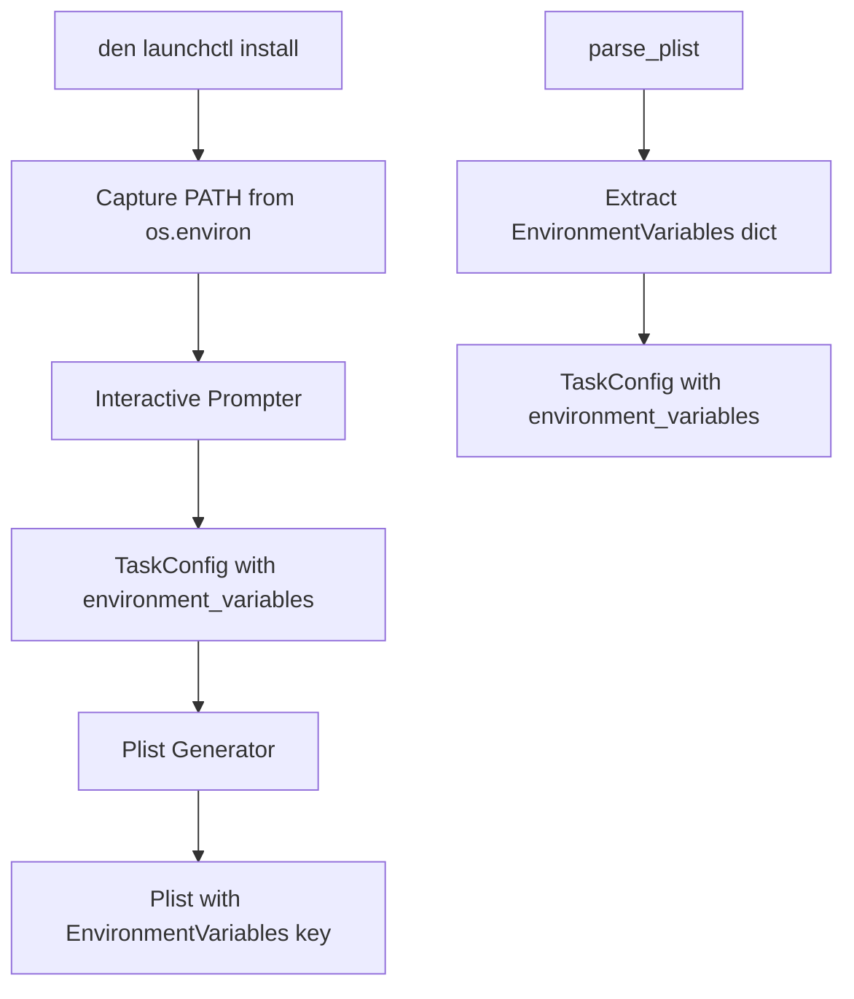

# Design Document: Plist Environment Variables Support

## Overview

This feature extends the LaunchAgent plist generator to support environment variables, specifically addressing the common issue where scheduled tasks fail because launchd runs jobs in a minimal environment without the user's shell PATH. By adding an `EnvironmentVariables` key to generated plist files, commands like `brew` can be found when executed as scheduled tasks.

The implementation extends the existing `TaskConfig` dataclass and `plist_generator.py` module, with minimal changes to the `launchctl install` command to auto-capture the current PATH.

## Architecture



The change is localized to:
1. `TaskConfig` dataclass - add `environment_variables` field
2. `generate_plist()` - include `EnvironmentVariables` key when present
3. `parse_plist()` - extract `EnvironmentVariables` into TaskConfig
4. `launchctl install` command - capture PATH from environment

## Components and Interfaces

### 1. Updated TaskConfig (`plist_generator.py`)

The dataclass gains a new optional field for environment variables.

```python
@dataclass
class TaskConfig:
    """Configuration for a LaunchAgent task.
    
    Attributes:
        label: The unique identifier for the LaunchAgent (domain.task format).
        program_arguments: List of command and arguments to execute.
        start_interval: Interval in seconds between runs (mutually exclusive with calendar).
        start_calendar_hour: Hour (0-23) for calendar-based scheduling.
        start_calendar_minute: Minute (0-59) for calendar-based scheduling.
        run_at_load: Whether to run immediately when loaded.
        environment_variables: Dict of environment variables to set when executing.
    """
    label: str
    program_arguments: list[str]
    start_interval: int | None = None
    start_calendar_hour: int | None = None
    start_calendar_minute: int | None = None
    run_at_load: bool = True
    environment_variables: dict[str, str] | None = None
```

### 2. Updated generate_plist (`plist_generator.py`)

```python
def generate_plist(config: TaskConfig) -> str:
    """Generate plist XML content from task configuration.
    
    Args:
        config: The task configuration.
        
    Returns:
        Valid plist XML string.
        
    Raises:
        PlistGenerationError: If the config is invalid.
    
    When environment_variables is set and non-empty, includes:
        <key>EnvironmentVariables</key>
        <dict>
            <key>PATH</key>
            <string>/opt/homebrew/bin:/usr/local/bin:...</string>
        </dict>
    """
```

### 3. Updated parse_plist (`plist_generator.py`)

```python
def parse_plist(content: str) -> TaskConfig:
    """Parse plist XML content into task configuration.
    
    Args:
        content: The plist XML string.
        
    Returns:
        TaskConfig parsed from the plist, including environment_variables
        if the EnvironmentVariables key is present.
        
    Raises:
        PlistParseError: If the content is not valid plist XML.
    """
```

### 4. Updated launchctl install (`commands/launchctl.py`)

```python
@launchctl_app.command()
def install() -> None:
    """Create and load a new LaunchAgent through interactive prompts.
    
    Automatically captures the current PATH environment variable
    to ensure scheduled commands can find executables.
    """
```

## Data Models

### Updated TaskConfig

```python
@dataclass
class TaskConfig:
    label: str
    program_arguments: list[str]
    start_interval: int | None = None
    start_calendar_hour: int | None = None
    start_calendar_minute: int | None = None
    run_at_load: bool = True
    environment_variables: dict[str, str] | None = None  # NEW
```

### Updated Plist XML Structure

```xml
<?xml version="1.0" encoding="UTF-8"?>
<!DOCTYPE plist PUBLIC "-//Apple//DTD PLIST 1.0//EN" "http://www.apple.com/DTDs/PropertyList-1.0.dtd">
<plist version="1.0">
<dict>
    <key>Label</key>
    <string>{domain}.{task}</string>
    <key>ProgramArguments</key>
    <array>
        <string>{command}</string>
        <string>{arg1}</string>
    </array>
    <!-- NEW: EnvironmentVariables section -->
    <key>EnvironmentVariables</key>
    <dict>
        <key>PATH</key>
        <string>/opt/homebrew/bin:/usr/local/bin:/usr/bin:/bin</string>
    </dict>
    <key>StartInterval</key>
    <integer>{seconds}</integer>
    <key>RunAtLoad</key>
    <true/>
</dict>
</plist>
```

## Correctness Properties

*A property is a characteristic or behavior that should hold true across all valid executions of a system-essentially, a formal statement about what the system should do. Properties serve as the bridge between human-readable specifications and machine-verifiable correctness guarantees.*

### Property 1: Environment Variables Round-Trip Consistency

*For any* valid `TaskConfig` with a non-empty `environment_variables` dict, generating a plist XML string and then parsing it back should produce a `TaskConfig` with equivalent `environment_variables` content, including preservation of special characters in values.

**Validates: Requirements 1.1, 1.2, 1.4, 3.1, 3.2**

### Property 2: Empty Environment Variables Omission

*For any* valid `TaskConfig` where `environment_variables` is `None` or an empty dict, the generated plist XML should not contain the `EnvironmentVariables` key.

**Validates: Requirements 1.3**

## Error Handling

### Environment Variable Errors

- **PATH not in environment**: Proceed without setting PATH in the plist (graceful degradation)
- **Empty environment_variables dict**: Treat as None, omit EnvironmentVariables key from plist

### Plist Generation Errors

- **Invalid environment variable key**: plistlib handles this; keys must be strings
- **Invalid environment variable value**: plistlib handles this; values must be strings

### Plist Parsing Errors

- **Malformed EnvironmentVariables**: If present but not a dict, raise `PlistParseError`
- **Non-string values in EnvironmentVariables**: Raise `PlistParseError` with descriptive message

## Testing Strategy

### Property-Based Testing

The implementation will use **Hypothesis** for property-based testing. Each correctness property will be implemented as a separate property-based test with a minimum of 100 iterations.

Property tests will be tagged with comments in the format:
`**Feature: plist-environment-variables, Property {number}: {property_text}**`

Key generators needed:
- `valid_env_var_names()`: Generates valid environment variable names (alphanumeric + underscore, not starting with digit)
- `valid_env_var_values()`: Generates string values including special characters, paths with colons
- `valid_environment_variables()`: Generates dict[str, str] with valid env var names and values
- `task_configs_with_env_vars()`: Generates TaskConfig objects with environment_variables set

### Unit Testing

Unit tests will cover:
- `generate_plist` with environment variables present
- `generate_plist` with environment variables absent/empty
- `parse_plist` with EnvironmentVariables key present
- `parse_plist` with EnvironmentVariables key absent
- `launchctl install` capturing PATH from environment

### Test File Organization

Tests will be added to existing test files:
```
tests/
├── test_launchctl_properties.py  # Add Property 1 and 2 tests
└── test_plist_generator.py       # Add unit tests for env var handling (if exists)
```
