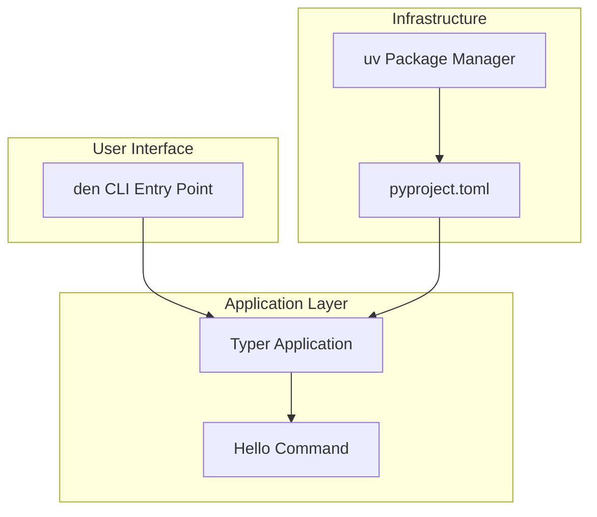

# Design: den CLI Application

## Overview

The `den` CLI application is a Python command-line utility built using the Typer framework. It serves as a foundation for local machine automations, starting with a simple "Hello World" command to verify functionality. The project uses modern Python tooling including uv for package management and pyproject.toml for configuration.

## Architecture



The architecture follows a simple layered approach:
- **Entry Point**: The `den` command registered via pyproject.toml scripts
- **Application Layer**: Typer application instance with registered commands
- **Commands**: Individual command modules (starting with hello)

## Components

### Main Application (`src/den/main.py`)

The central Typer application that serves as the command registry.

```python
import typer

app = typer.Typer(
    name="den",
    help="A CLI utility for local machine automations.",
    add_completion=False,
)
```

### Hello Command (`src/den/commands/hello.py`)

The initial command for testing CLI functionality.

```python
def hello(name: str = typer.Option("World", help="Name to greet")) -> None:
    """Say hello to someone."""
    typer.echo(f"Hello, {name}!")
```

## Data Models

This initial implementation has minimal data models. The primary data flow is:

```
CLI Arguments → Typer Parser → Command Function → stdout/stderr + Exit Code
```

### Greeting Message
- Format: `"Hello, {name}!"`
- Default name: `"World"`
- Character encoding: UTF-8

## Correctness Properties

### Property 1: Name greeting format consistency
For any valid name string provided to the hello command, the output SHALL contain the exact format "Hello, {name}!" where {name} is the provided input.

### Property 2: Successful execution exit code
For any valid invocation of the hello command (with or without the --name option), the command SHALL return exit code 0.

### Property 3: Greeting string round-trip consistency
For any greeting message produced by the hello command, serializing the string to bytes (UTF-8) and deserializing back to a string SHALL produce an equivalent value.

## Error Handling

### CLI Argument Errors
Typer handles invalid arguments automatically:
- Unknown options: Display error message and help
- Invalid option values: Display validation error
- Exit code: Non-zero for errors

### Runtime Errors
For this initial implementation, runtime errors are minimal:
- The hello command has no failure modes with valid input
- Future commands should use `typer.Exit(code=1)` for errors
- Error messages should be written to stderr via `typer.echo(..., err=True)`
