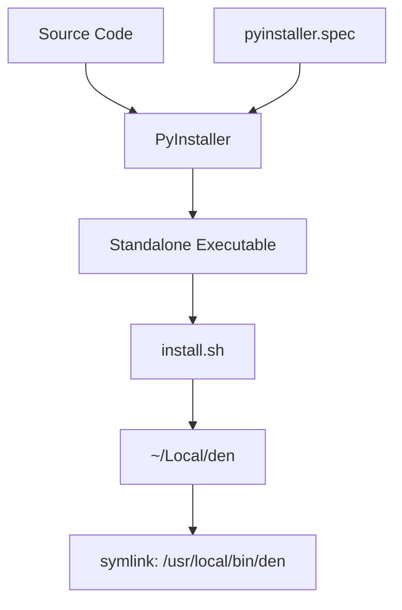

# Design: Executable Packaging

## Overview

This design describes how to package the den CLI application as a standalone executable binary and provide an installation script for deploying it to `/usr/local/bin/den` on macOS. The solution uses PyInstaller to bundle the Python application with all dependencies into a single executable file.

## Architecture

The packaging system consists of two main components:

1. **PyInstaller Configuration** - A `.spec` file that defines how to bundle the application
2. **Installation Script** - A shell script (`install.sh`) that orchestrates the build and installation process



## Components

### PyInstaller Spec File (`den.spec`)

The spec file configures PyInstaller to:
- Use `src/den/main.py` as the entry point
- Bundle all dependencies (typer, anthropic, httpx)
- Create a single-file executable (`--onefile` mode)
- Name the output executable "den"

### Installation Script (`install.sh`)

A bash script that:
1. Checks for required tools (Python, pip, PyInstaller)
2. Installs PyInstaller if not present
3. Runs PyInstaller with the spec file
4. Creates `~/Local` directory if it doesn't exist
5. Copies the executable to `~/Local/den`
6. Creates a symbolic link from `/usr/local/bin/den` to `~/Local/den` using sudo
7. Verifies the installation

```bash
#!/bin/bash
# install.sh interface
# Usage: ./install.sh
# Exit codes:
#   0 - Success
#   1 - Missing dependencies
#   2 - Build failed
#   3 - Installation failed
```

## Data Models

No persistent data models are required for this feature. The packaging process operates on:

- **Input**: Python source files, dependencies from `pyproject.toml`
- **Output**: Single executable binary file

## Error Handling

| Error Condition | Handling | Exit Code |
|----------------|----------|-----------|
| Python not installed | Display error message with installation instructions | 1 |
| PyInstaller not available | Attempt to install via pip, fail if unsuccessful | 1 |
| Build fails | Display PyInstaller error output | 2 |
| Cannot create ~/Local directory | Display error message | 3 |
| Cannot create symlink in `/usr/local/bin` | Prompt for sudo, fail if denied | 3 |
| Verification fails | Display diagnostic information | 3 |

## Testing Strategy

Since this feature involves system-level operations (file installation, executable creation), testing is primarily manual:

1. **Build Verification**
   - Run `./install.sh` and verify it completes without errors
   - Check that `dist/den` executable exists after build

2. **Installation Verification**
   - Verify `/usr/local/bin/den` exists after installation
   - Run `den --version` and verify correct output
   - Run `den hello` and verify functionality

3. **Error Handling Verification**
   - Test with missing Python (if possible)
   - Test without sudo access
   - Test with corrupted source files
