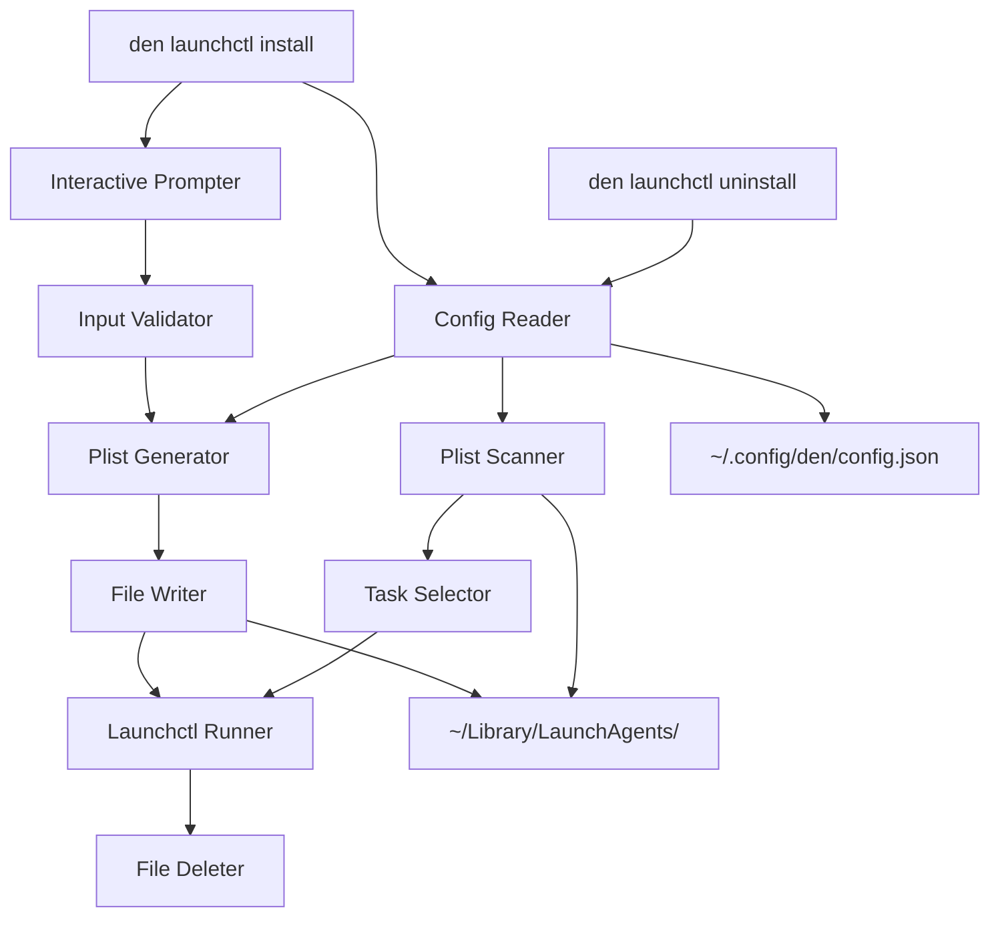

# Design: LaunchCtl Helper Command

## Overview

The LaunchCtl helper command extends the `den` CLI with capabilities to create and manage macOS LaunchAgent plist files through an interactive experience. The feature provides two subcommands (`install` and `uninstall`) that abstract away the complexity of XML plist file creation and `launchctl` system commands.

The implementation follows the existing `den` CLI patterns using Typer for command-line interface construction, with dedicated modules for configuration management, plist generation, and launchctl operations.

## Architecture



Both `install` and `uninstall` commands read the domain from the config file:
- **install**: Uses the domain to construct the plist label and filename (`[domain].[task].plist`)
- **uninstall**: Uses the domain to filter which plist files to display for selection

## Components

### Config Reader (`launchctl_config.py`)
Responsible for reading the domain configuration from the user's config file.

### Input Validator (`launchctl_validator.py`)
Validates user input for task names, commands, and schedule values.

### Plist Generator (`plist_generator.py`)
Generates valid XML plist content from task configuration.

### Launchctl Runner (`launchctl_runner.py`)
Executes launchctl system commands for loading and unloading agents.

### Plist Scanner (`plist_scanner.py`)
Scans the LaunchAgents directory for existing tasks.

### Launchctl Command (`commands/launchctl.py`)
The Typer command group that orchestrates the interactive flow.

## Data Models

### TaskConfig

```python
@dataclass
class TaskConfig:
    label: str
    program_arguments: list[str]
    start_interval: int | None = None
    start_calendar_hour: int | None = None
    start_calendar_minute: int | None = None
    run_at_load: bool = True
```

### Plist XML Structure

```xml
<?xml version="1.0" encoding="UTF-8"?>
<!DOCTYPE plist PUBLIC "-//Apple//DTD PLIST 1.0//EN" "http://www.apple.com/DTDs/PropertyList-1.0.dtd">
<plist version="1.0">
<dict>
    <key>Label</key>
    <string>{domain}.{task}</string>
    <key>ProgramArguments</key>
    <array>
        <string>{command}</string>
        <string>{arg1}</string>
    </array>
    <key>StartInterval</key>
    <integer>{seconds}</integer>
    <!-- OR -->
    <key>StartCalendarInterval</key>
    <dict>
        <key>Hour</key>
        <integer>{hour}</integer>
        <key>Minute</key>
        <integer>{minute}</integer>
    </dict>
    <key>RunAtLoad</key>
    <true/>
</dict>
</plist>
```

## Correctness Properties

### Property 1: Plist Round-Trip Consistency
For any valid `TaskConfig`, generating a plist XML string and then parsing it back should produce an equivalent `TaskConfig` object.

### Property 2: Label Matches Configuration
For any valid domain string and task name, the generated plist's Label value should equal `{domain}.{task}`.

### Property 3: Command Arguments Preserved
For any valid `TaskConfig` with a non-empty `program_arguments` list, the generated plist should contain all command arguments in the same order.

### Property 4: Schedule Configuration Preserved
For any valid `TaskConfig` with either `start_interval` set or `start_calendar_hour`/`start_calendar_minute` set, the generated plist should contain the corresponding scheduling keys with the exact values specified.

### Property 5: Filename Format Correctness
For any valid domain string and task name, the constructed plist filename should match the pattern `{domain}.{task}.plist`.

### Property 6: Domain Prefix Scanning Correctness
For any set of plist filenames and a domain prefix, the scanner should return exactly those files whose names start with `{domain}.` and end with `.plist`.

### Property 7: Task Name Character Validation
For any string containing spaces, slashes, or special characters (other than hyphens and underscores), the task name validator should reject it.

### Property 8: Interval Validation
For any integer less than or equal to zero, the interval validator should reject it. For any positive integer, the validator should accept it.

### Property 9: Hour Validation
For any integer outside the range 0-23, the hour validator should reject it. For any integer in the range 0-23, the validator should accept it.

### Property 10: Minute Validation
For any integer outside the range 0-59, the minute validator should reject it. For any integer in the range 0-59, the validator should accept it.

## Error Handling

### Configuration Errors
- **Missing config file**: Return default domain `com.example` without error
- **Invalid JSON in config file**: Log warning and return default domain
- **Missing domain key**: Return default domain without error

### Plist Generation Errors
- **Invalid TaskConfig**: Raise `PlistGenerationError` with descriptive message
- **File write failure**: Raise `OSError` with path information

### Launchctl Errors
- **Load failure**: Raise `LaunchctlError` with stderr output from launchctl
- **Unload failure**: Raise `LaunchctlError` with stderr output from launchctl
- **Permission denied**: Raise `LaunchctlError` indicating permission issue

### Scanner Errors
- **LaunchAgents directory missing**: Return empty list (directory may not exist yet)
- **Permission denied reading directory**: Raise `OSError` with descriptive message
