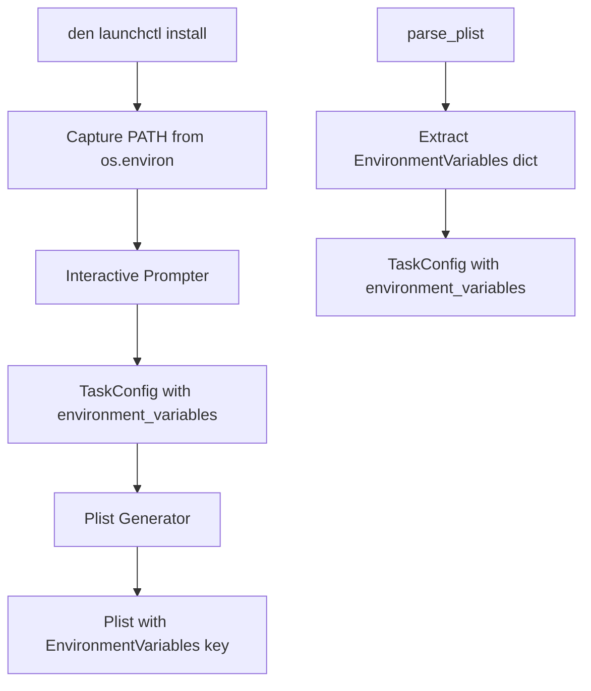

# Design: Plist Environment Variables Support

## Overview

This feature extends the LaunchAgent plist generator to support environment variables, specifically addressing the common issue where scheduled tasks fail because launchd runs jobs in a minimal environment without the user's shell PATH. By adding an `EnvironmentVariables` key to generated plist files, commands like `brew` can be found when executed as scheduled tasks.

The implementation extends the existing `TaskConfig` dataclass and `plist_generator.py` module, with minimal changes to the `launchctl install` command to auto-capture the current PATH.

## Architecture



The change is localized to:
1. `TaskConfig` dataclass - add `environment_variables` field
2. `generate_plist()` - include `EnvironmentVariables` key when present
3. `parse_plist()` - extract `EnvironmentVariables` into TaskConfig
4. `launchctl install` command - capture PATH from environment

## Components

### Updated TaskConfig (`plist_generator.py`)

The dataclass gains a new optional field for environment variables.

```python
@dataclass
class TaskConfig:
    label: str
    program_arguments: list[str]
    start_interval: int | None = None
    start_calendar_hour: int | None = None
    start_calendar_minute: int | None = None
    run_at_load: bool = True
    environment_variables: dict[str, str] | None = None
```

## Data Models

### Updated Plist XML Structure

```xml
<?xml version="1.0" encoding="UTF-8"?>
<!DOCTYPE plist PUBLIC "-//Apple//DTD PLIST 1.0//EN" "http://www.apple.com/DTDs/PropertyList-1.0.dtd">
<plist version="1.0">
<dict>
    <key>Label</key>
    <string>{domain}.{task}</string>
    <key>ProgramArguments</key>
    <array>
        <string>{command}</string>
        <string>{arg1}</string>
    </array>
    <!-- NEW: EnvironmentVariables section -->
    <key>EnvironmentVariables</key>
    <dict>
        <key>PATH</key>
        <string>/opt/homebrew/bin:/usr/local/bin:/usr/bin:/bin</string>
    </dict>
    <key>StartInterval</key>
    <integer>{seconds}</integer>
    <key>RunAtLoad</key>
    <true/>
</dict>
</plist>
```

## Correctness Properties

### Property 1: Environment Variables Round-Trip Consistency
For any valid `TaskConfig` with a non-empty `environment_variables` dict, generating a plist XML string and then parsing it back should produce a `TaskConfig` with equivalent `environment_variables` content, including preservation of special characters in values.

### Property 2: Empty Environment Variables Omission
For any valid `TaskConfig` where `environment_variables` is `None` or an empty dict, the generated plist XML should not contain the `EnvironmentVariables` key.

## Error Handling

### Environment Variable Errors
- **PATH not in environment**: Proceed without setting PATH in the plist (graceful degradation)
- **Empty environment_variables dict**: Treat as None, omit EnvironmentVariables key from plist

### Plist Generation Errors
- **Invalid environment variable key**: plistlib handles this; keys must be strings
- **Invalid environment variable value**: plistlib handles this; values must be strings

### Plist Parsing Errors
- **Malformed EnvironmentVariables**: If present but not a dict, raise `PlistParseError`
- **Non-string values in EnvironmentVariables**: Raise `PlistParseError` with descriptive message
